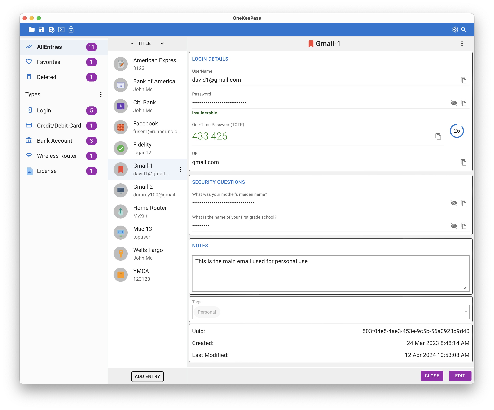
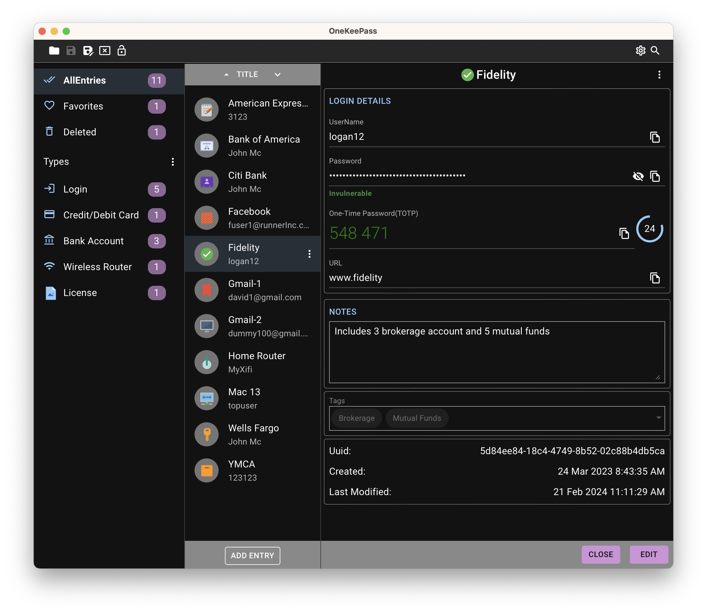

<h1 align="center">
  
   
  
OneKeePass

</h1>

**OneKeePass** is a cross-platform,open source and secure password manager. It supports the KeePass-compatible database (Kdbx 4.x). It stores and manages all your passwords and other sensitive information in a single encrypted file that can be stored in any location, including private and public cloud solutions. The database is locked with a master key. 

All created database files are encrypted using the best and most secure encryption algorithms currently known (AES-256, ChaCha20).

<h1 align="center">
  
   
</h1>

<h1 align="center">
  
   
</h1>

## Features
- Simple and Modern UI
- Entries are grouped as Types or Categories or the standard Group tree
- Custom entry type with any set of fields can be created as template and used to create entries
- Any number of custom fields can be added
- Custom fields can be organized as sections
- Upload attachments to an entry
- Basic Auto-Type feature that sends simulated keypresses to other applications in macOS
- Quick database unlock feature using TouchID for macOS
- Any number of databases can be created and used
- Optional additional security by using a key file with or without a master password
- Time based One-Time Passwords (TOTP) can added and used
- Supports Light/Dark Theme
- Multi-language support 
- Fully offline 

## Todo

- [ ] Merge changed entries
- [ ] Browser extension and integration
- [ ] Synchronize the database between the devices 

## Installation and Quick start

You can start using OneKeePass on your Windows, macOS, or Linux computer using the latest pre-compiled binaries from the **[downloads page](https://github.com/OneKeePass/desktop/releases)**

OneKeePass is also available for iOS and Android platforms. See [here](https://github.com/OneKeePass/mobile) for details

 

Common **FAQ** about the application can be found [here](./docs/FAQ.md)

## How to build

OneKeePass is developed primarily using the ClojureScript and Rust programming languages and is built with - [Tauri](https://tauri.app/),[React](https://react.dev/),[MUI](https://mui.com/) and many Rust crates

To build your own binary, please follow the instructions [here](./docs/BUILD.md)

 
## How to Contribute
The CONTRIBUTING document and other guidelines for code contributions are not yet ready. Till that time, please feel free to::
- [Report bugs, suggest new features](https://github.com/OneKeePass/desktop/issues)

## License
This project is licensed under the GPLv3.
