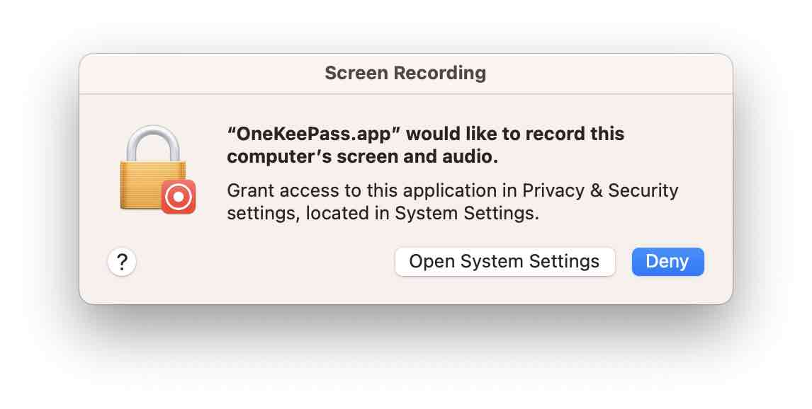
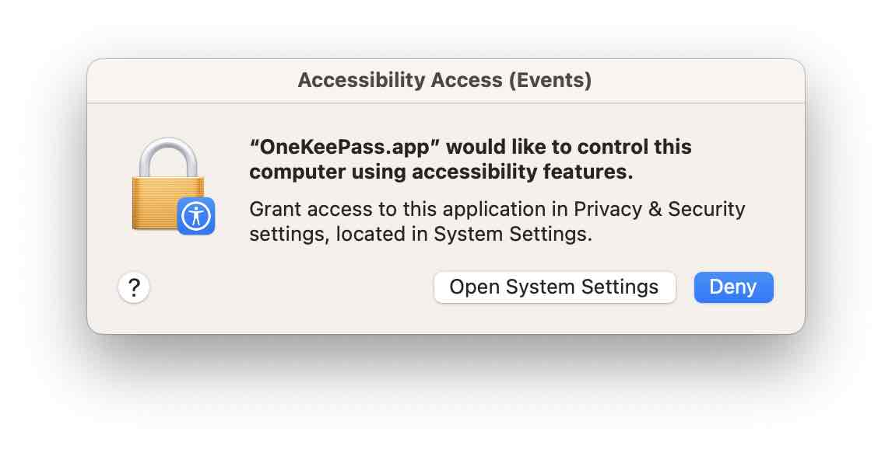

### Auto-Type
Current few basic Auto-Type features (in MacOS) are supported. Using these you can send data from your entries directly into the corresponding websites or applications by simulating key presses. 

At this time the Auto-Type feature works only at the entry level. 

In macOS, for the auto type to work, the user needs to give the following permissions: 

Screen Recording

<h1 align="center">
  
   
</h1>

Accessibility Access (Events)

<h1 align="center">
  
   
</h1>

#### Invoking Auto-Type

1. First open the target window, for example login page in a website and make sure the first input
   control has the focus

2. Go to OneKeePass and select the corresponding entry that has the required entry form field values and click menu item **Perform auto type**

3. You can create or modify the sequence by using the menu item **Edit auto type** on the entry form

#### Supported Actions
{TAB}, {ENTER}, {SPACE} 
{TAB X}, {ENTER X}, {SPACE X}  where X indicates to repeat the key X times 

{DELAY=X}  -  This sets the delay between key presses to X milliseconds

{DELAY X}  - This pauses typing for X milliseconds

#### Entry Form Fields

Standard fields such as {USERNAME},{PASSWORD},{TITLE},{URL} and {S:ANY CUSTOM FIELD} can be used in the sequence

   