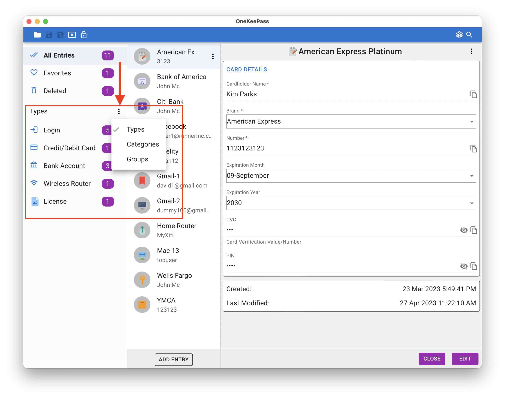
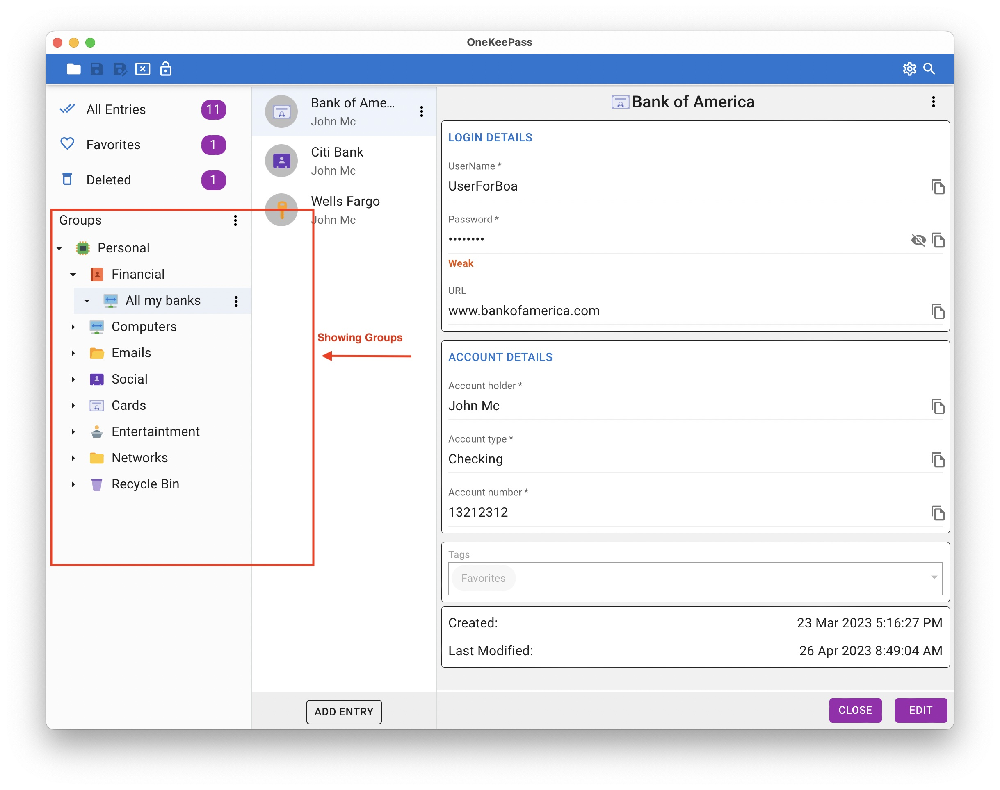
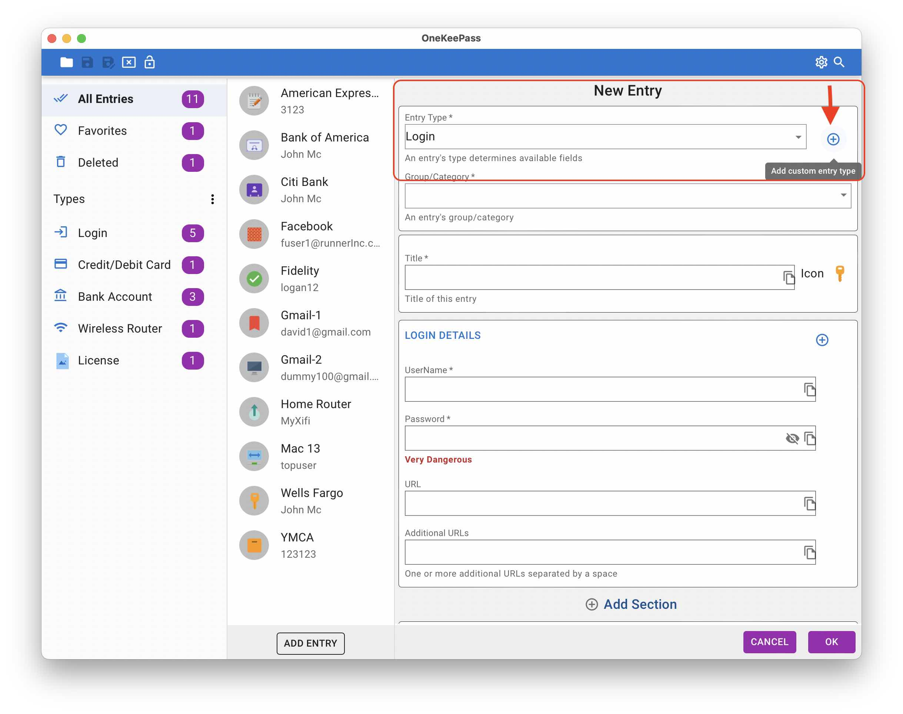

# Frequently Asked Questions

Here are some common ones. More will be added in due time

## Where and how the database is stored?
OneKeePass stores all your passwords and other details in a single encrypted file in any place of your choosing in the file system 

***WARNING: OneKeePass does not check whether the database file has been changed outside or not before saving. Because of this the file may be overwritten. This issue will be fixed in the next version***  

 

## What is the format of the OneKeePass database?
OneKeePass supports the well known [KeePass](https://keepass.info/help/kb/kdbx_4.1.html) database format KDBX 4

## How many databases can be opened ?
You can open many databases at the same time. Each database is opened in a separate tab

## How to synchrozie the database file between devices?
OneKeePass does not do any automatic synchronization at this time. As the password database is a single file, you can 
use any of the cloud storage service for the synchronization between devices and also for the backup

## How are entries organized ?
Entries are organized so that you can view them as  Entry types or Categories or Group tree. 

Types

<h1 align="center">
  
   
</h1>

Categories

<h1 align="center">
  
   
</h1>

Groups

<h1 align="center">
  
   
</h1>

## What are the entry categories ?
It is just the flattened list of keepass groups instead of a tree/folder like structure

## What is an entry type?
Each entry type has certain set of fields. For example *Login* entry type include fields like username, password, url etc.
OneKeePass supports some built-in standard entry types: Login, Credit/Debit Card, Bank Account and Wireless Router.
More standard entry types will be added. 

## Can I create custom entry type?
You can create a custom type with sections and fields. Such custom entry type can be used as template while creating new entries

See the image here

<h1 align="center">
  
   
</h1>

