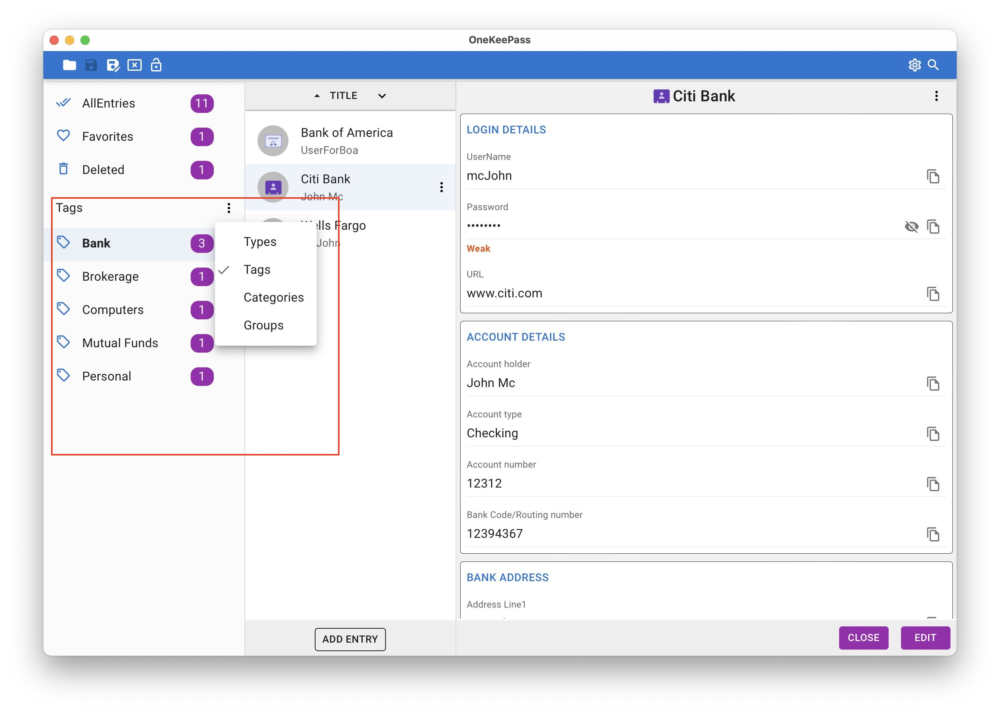
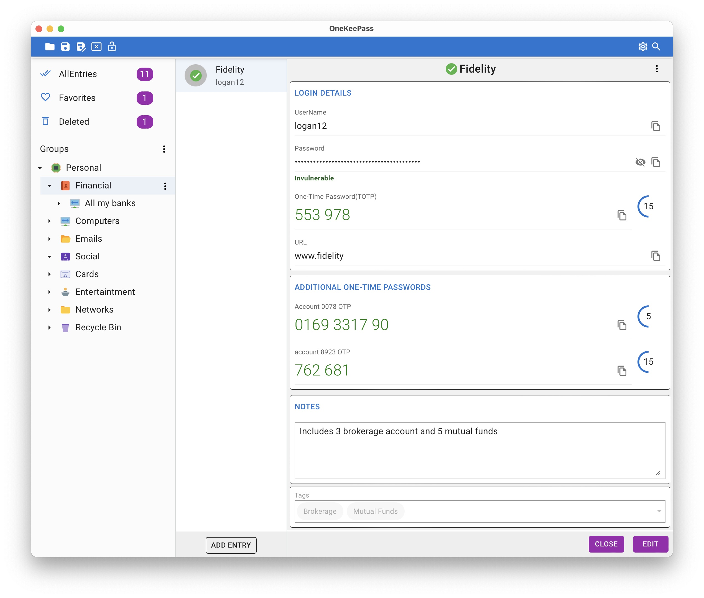

# Frequently Asked Questions

Here are some common ones. More will be added in due time

## Where and how the database is stored?
OneKeePass stores all your passwords and other details in a single encrypted file in any place of your choosing in the file system 

## What is the format of the OneKeePass database?
OneKeePass supports the well known [KeePass](https://keepass.info/help/kb/kdbx_4.1.html) database format KDBX 4

## How many databases can be opened ?
You can open many databases at the same time. Each database is opened in a separate tab

## How to synchrozie the database file between devices?
OneKeePass does not do any automatic synchronization at this time. As the password database is a single file, you can 
use any of the cloud storage service for the synchronization between devices and also for the backup

## What is a key file ?
A key file is a file containing random bytes that is used in addition to your master key for additional security. You can basically use any file you want as a key file. Such a file should have random bytes data and the content of this random data remains the same as long as it is used as key file.

## What is a master key?
The database file is encrypted using a master key. This master key is derived using multiple components: a master password, a key file or both

Accordingly you can use only a master password or only a key file or both to secure your database

## How are entries organized ?
Entries are organized so that you can view them as  Entry types or Categories or Group tree or Tagged entries. 

Types

<h1 align="center">
  
   
</h1>

Tags

<h1 align="center">
  
   
</h1>

Categories

<h1 align="center">
  
   
</h1>

Groups

<h1 align="center">
  
   
</h1>

## What are the entry categories ?
It is just the flattened list of keepass groups instead of a tree/folder like structure

## What is an entry type?
Each entry type has certain set of fields. For example *Login* entry type include fields like username, password, url etc.
OneKeePass supports some built-in standard entry types: Login, Credit/Debit Card, Bank Account and Wireless Router.
More standard entry types will be added. 

## Can I create custom entry type?
You can create a custom type with sections and fields. Such custom entry type can be used as template while creating new entries

See the image here

<h1 align="center">
  
   
</h1>

## Are file attachments supported?
Yes. You can attach any number of files to an entry. In the entry form screen, you can upload, view and delete. Any previously attahed file can be copied to a location outside the database.

It is recommended to use this feature only to store few/small files.
 
As these attached file contents are encrypted and stored within the database, attaching many/large files is considered to be out of the scope of a password manager. The database opening and saving then will be slow. It is better to use a specialized file encryption softwares - VeraCrypt,Cryptomator - to store many/large files

## How do to add one or more TOTPs (Timed One-Time Passwords) to an Entry?
Select an entry and click **Edit** button or add a new entry. When the entry form is in edit mode, you can click **Set up One-Time Password** to add a TOTP - [Fig 1](../screenshots/to-show-setupotp-additional-otp-link.jpg). A dialog box is opened - [Fig 2](../screenshots/setup-otp-dialog1.jpg). In the dialog box, you can enter the secret string or OTP url that you got from the website or application you are authenticating to. On entering valid values, the otp token will be generated 

You can add more than one TOTP fields for an Entry under the section **ADDITIONAL ONE-TIME PASSWORDS**. To add additional OTP fields, please click on the **+** as seen in [Fig 1](../screenshots/to-show-setupotp-additional-otp-link.jpg). In the opened dialog - see [Fig 3](../screenshots/Additional-otp-dialog1.jpg) and [Fig 4](../screenshots/Additional-otp-dialog2.jpg), please provide a field name and then secret string or otp url

If you want to update or to change an OTP field, the existing field needs to be deleted first and added with new values

You can see generated OTP values with progress indicators

<h1 align="center">
  
   
</h1>

## Is Auto-Type supported ?
Yes. For now few basic features are supported for macOS and soon supports for other platforms will be added. See [here](./AUTO-TYPE.md) for additional details

