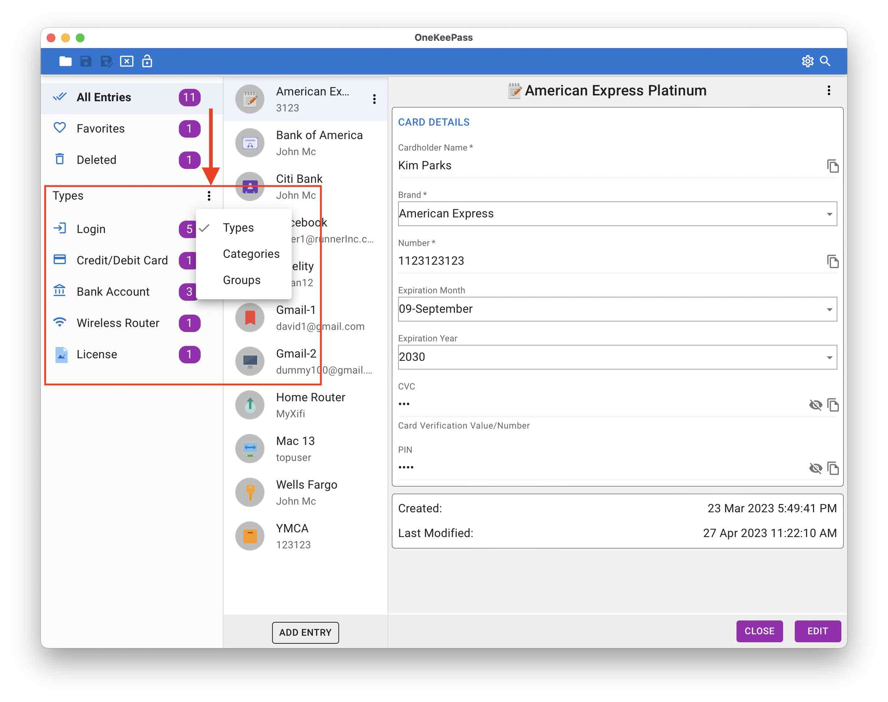
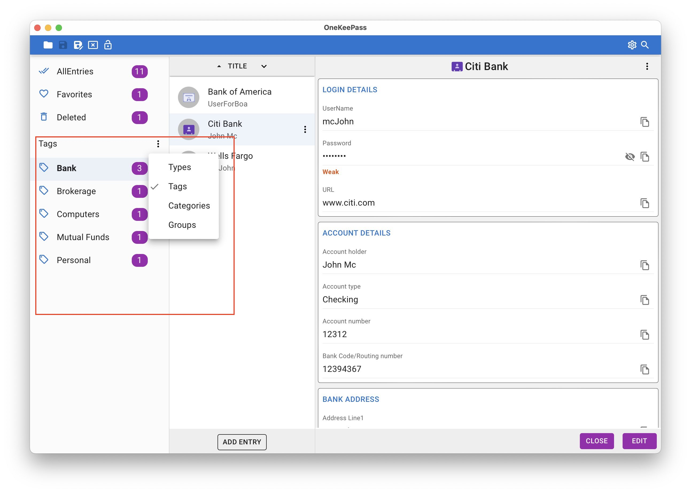
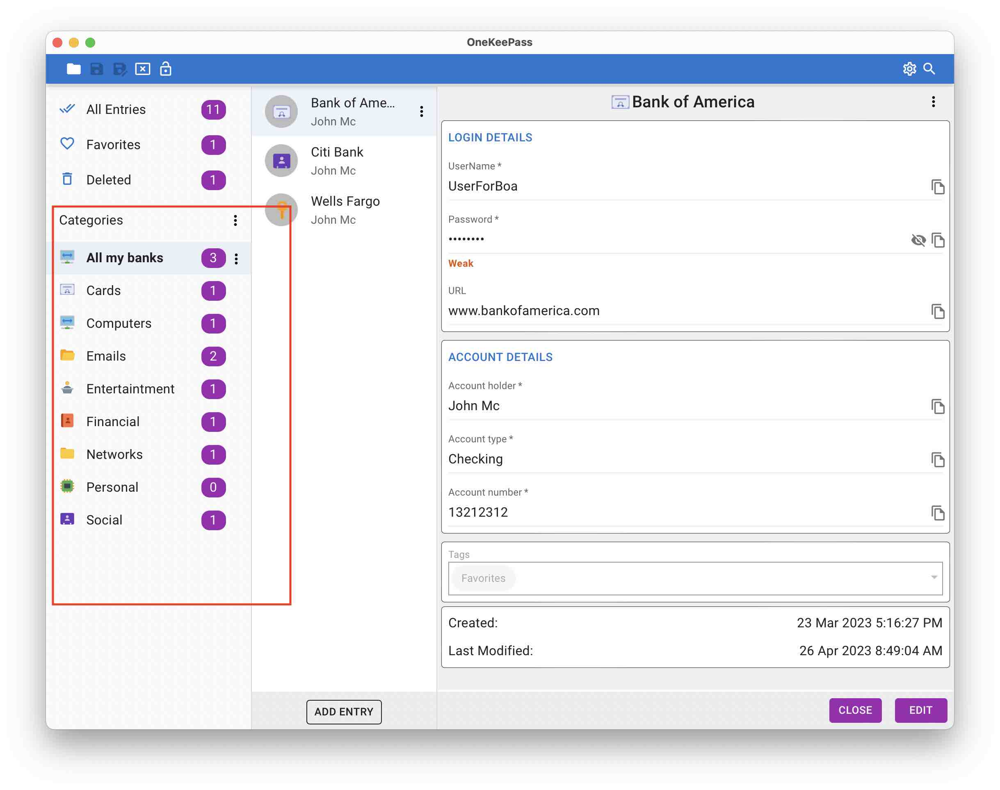
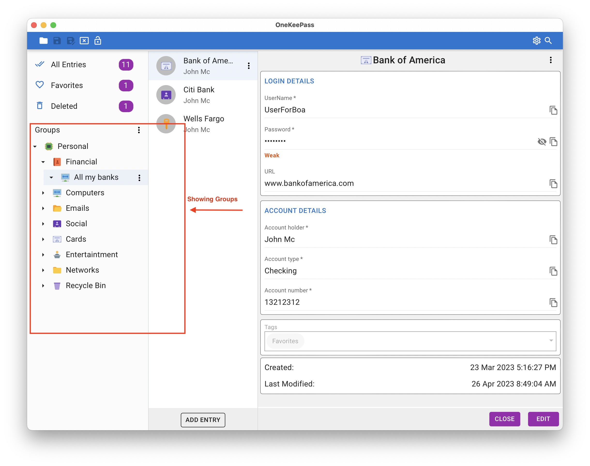
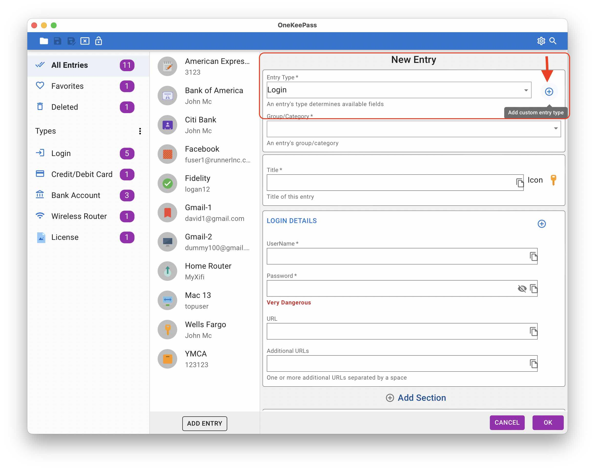
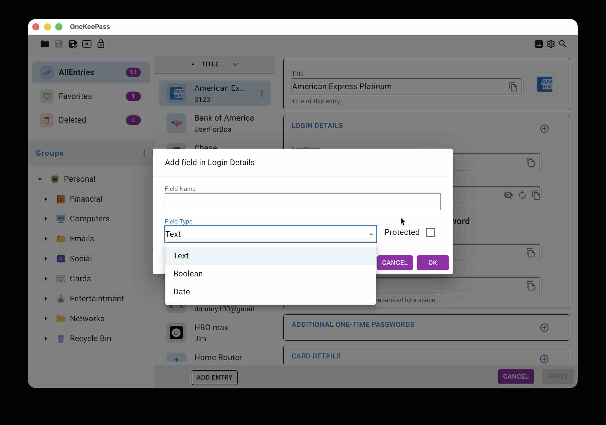
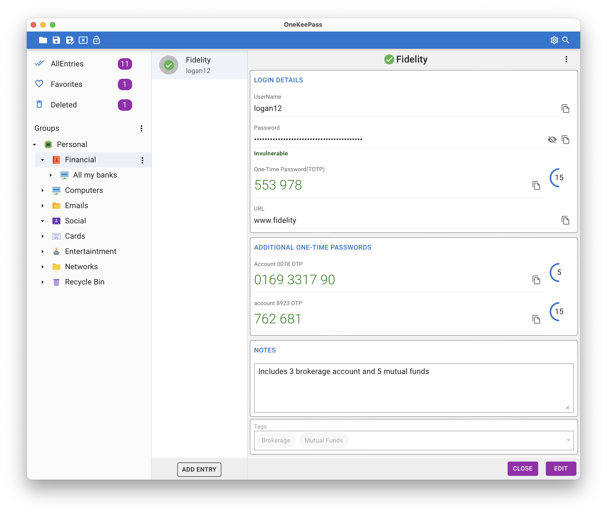
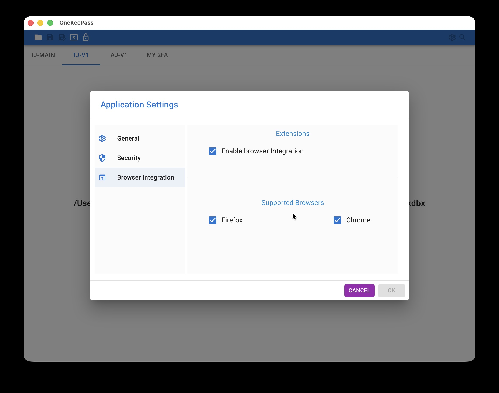
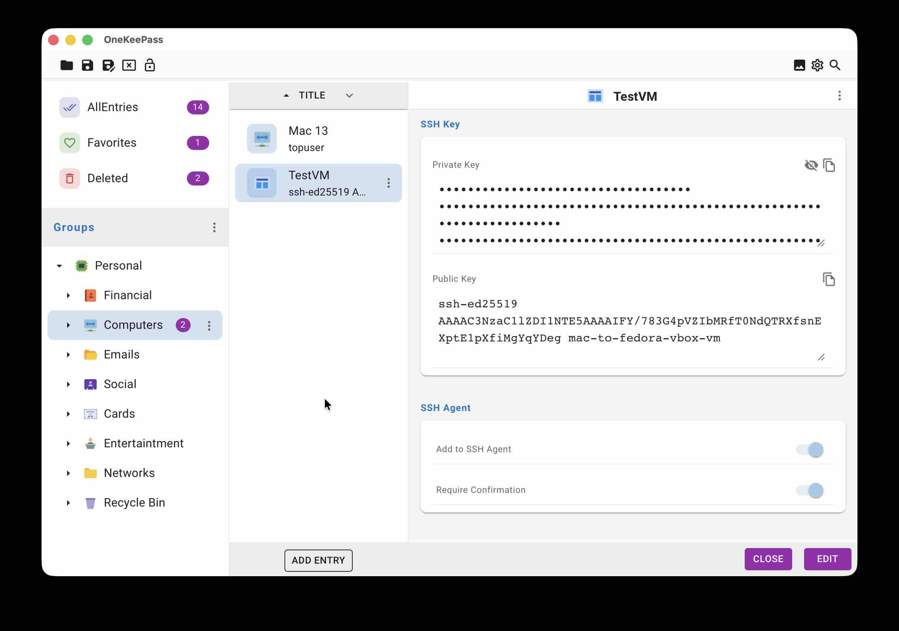
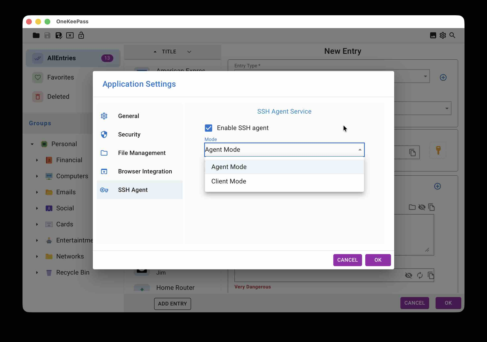

# Frequently Asked Questions

Here are some common ones. More will be added in due time

## Where and how the database is stored?
OneKeePass stores all your passwords and other details in a single encrypted file in any place of your choosing in the file system 

## What is the format of the OneKeePass database?
OneKeePass supports the well known [KeePass](https://keepass.info/help/kb/kdbx_4.1.html) database format KDBX 4

## How many databases can be opened ?
You can open many databases at the same time. Each database is opened in a separate tab

## How to synchrozie the database file between devices?
OneKeePass does not do any automatic synchronization at this time. As the password database is a single file, you can 
use any of the cloud storage service for the synchronization between devices and also for the backup

## What is a key file ?
A key file is a file containing random bytes that is used in addition to your master key for additional security. You can basically use any file you want as a key file. Such a file should have random bytes data and the content of this random data remains the same as long as it is used as key file.

## What is a master key?
The database file is encrypted using a master key. This master key is derived using multiple components: a master password, a key file or both

Accordingly you can use only a master password or only a key file or both to secure your database

## How are entries organized ?
Entries are organized so that you can view them as  Entry types or Categories or Group tree or Tagged entries. 

<details>
<summary>Types</summary>
<h1 align="center">
  
  <br>
</h1>
</details>

<details>
<summary>Tags</summary>
<h1 align="center">
  
  <br>
</h1>
</details>

<details>
<summary>Categories</summary>
<h1 align="center">
  
  <br>
</h1>
</details>

<details>
<summary>Groups</summary>
<h1 align="center">
  
  <br>
</h1>
</details>


## What are the entry categories ?
It is just the flattened list of keepass groups instead of a tree/folder like structure


## What is an entry type?
Each entry type has certain set of fields. For example *Login* entry type include fields like username, password, url etc.
OneKeePass supports several built-in standard entry types: Login, Credit/Debit Card, Bank Account, Identity, Passport, Driver License, SSH Key and Wireless Router.
More standard entry types will be added. 


## Can I create custom entry type?
You can create a custom type with sections and fields. Such custom entry type can be used as template while creating new entries

<details>
<summary>See the image here</summary>
<h1 align="center">
  
  <br>
</h1>

</details>

## What field types can a custom field have?

When you add a custom field to an entry, you can choose its data type: **Text**, **Boolean** or **Date**.

- A **Text** field is a normal value field (and can be marked as a protected/secret field).
- A **Boolean** field shows a switch that stores a true/false value.
- A **Date** field shows a date value and provides a date picker for selecting and editing the date.

These field types are also used by some of the built-in entry types (for example the date fields in *Passport* and *Driver License*).

<details>
<summary>See the field type selection here</summary>
<h1 align="center">
  
  <br>
</h1>
</details>

## Are file attachments supported?
Yes. You can attach any number of files to an entry. In the entry form screen, you can upload, view and delete. Any previously attahed file can be copied to a location outside the database.

It is recommended to use this feature only to store few/small files.
 
As these attached file contents are encrypted and stored within the database, attaching many/large files is considered to be out of the scope of a password manager. The database opening and saving then will be slow. It is better to use a specialized file encryption softwares - VeraCrypt,Cryptomator - to store many/large files

## How do to add one or more TOTPs (Timed One-Time Passwords) to an Entry?
Select an entry and click **Edit** button or add a new entry. When the entry form is in edit mode, you can click **Set up One-Time Password** to add a TOTP - [Fig 1](../screenshots/to-show-setupotp-additional-otp-link.jpg). A dialog box is opened - [Fig 2](../screenshots/setup-otp-dialog1.jpg). In the dialog box, you can enter the secret string or OTP url that you got from the website or application you are authenticating to. On entering valid values, the otp token will be generated 

You can add more than one TOTP fields for an Entry under the section **ADDITIONAL ONE-TIME PASSWORDS**. To add additional OTP fields, please click on the **+** as seen in [Fig 1](../screenshots/to-show-setupotp-additional-otp-link.jpg). In the opened dialog - see [Fig 3](../screenshots/Additional-otp-dialog1.jpg) and [Fig 4](../screenshots/Additional-otp-dialog2.jpg), please provide a field name and then secret string or otp url

If you want to update or to change an OTP field, the existing field needs to be deleted first and added with new values

<details>
<summary>You can see generated OTP values with progress indicators</summary>
<h1 align="center">
  
  <br>
</h1>
</details>

## Is Auto-Type supported ?
Yes. For now few basic features are supported for macOS and soon supports for other platforms will be added. See [here](./AUTO-TYPE.md) for additional details

## How to do Automatic Database Opening ?

One or more databases can be opened automatically when you open a single database. For this, you need to create a special group called **AutoOpen** under the root group. 

Create entries using the entry template/type **Auto Database Open** in this group. 

Enter the file path in the 'URL' field and password in the 'Password' field.  If there is any key file is used, then the key file path is entered in the 'UserName' field 

The database file path should start with **kdbx://**

Some examples are:

```
kdbx://./MyPasswords.kdbx

kdbx://{DB_DIR}/MyPasswords.kdbx

kdbx://{DB_DIR}/child-databases/MyPasswords.kdbx

```

Key file path examples:

```
./MyKeyFile.keyx

{DB_DIR}/MyKeyFile.keyx

{DB_DIR}/all-my-keys/MyKeyFile.keyx

```

When this main database is opened, all child databases will be opened automatically


## How to do merging of two databases?

After opening a database, you can use the application menu "Database -> Merge Database..." 

Then choose any of a valid keepass database file to merge with the currently opened file

## Can I import passwords from other password managers?

Yes. OneKeePass supports a basic importing passwords from CSV (Comma Separated Values) files. This is useful when migrating from another password manager or importing passwords you have exported.

**How to import a CSV file:**

1. Open or create a database where you want to import the passwords
2. Use the menu option **Database -> Import from CSV**
3. Select the CSV file you want to import
4. OneKeePass will process the CSV file and create entries in your database

**CSV file format:**

Your CSV file should contain password data with appropriate columns. The first row should contain column headers. Common column names include:
- `Title` or `Name` - entry title
- `UserName` or `Username` - username/login
- `Password` - password
- `URL` or `Url` - website URL
- `Notes` - additional notes or comments

**Supported features:**

- Multiple entries can be imported in a single CSV file
- Standard password fields (title, username, password, URL, notes) are recognized
- Additional custom fields can be included and will be created as part of the entry

**Note:** OneKeePass currently imports generic CSV formats. If you're exporting from another password manager, you may need to format the export to match the expected CSV structure, or the exported file may already be in a compatible format. 


## Does OneKeePass provide any Browser Extension?

Yes, a basic version is supported from OneKeePass 0.17.0 onwards. 

You can get the extension for [Firefox](https://addons.mozilla.org/en-US/firefox/addon/onekeepass-browser/) or [Chrome](https://chromewebstore.google.com/detail/onekeepass-browser/cmdmojmbfcpkloflnjkkdjcflaidangh)

After installing the extension in your browser, you also need to enable the browser extension use in OneKeePass's **Application Settings**

Application Settings -> Browser Integration -> Enable browser Integration -> Enable Firefox and Chrome

<details>
<summary>See the settings screen here</summary>
<h1 align="center">
  
  <br>
</h1>
</details>

## The browser extension can't connect to OneKeePass on Linux (Flatpak/Snap browser)

On immutable / atomic Linux distributions such as **Bazzite, Fedora Silverblue/Kinoite, and SteamOS**, the browser is usually installed as a **Flatpak** (or, on some distros, a **Snap**) rather than as a native package. A sandboxed browser cannot connect to OneKeePass even though everything looks correctly enabled, because:

- Flatpak Firefox does **not** read the native messaging manifest from `~/.mozilla/native-messaging-hosts/`. It only looks inside its own sandbox, at `~/.var/app/org.mozilla.firefox/.mozilla/native-messaging-hosts/`.
- Even when the manifest is found, the sandbox cannot launch the host `onekeepass-proxy` binary, and the proxy cannot reach the OneKeePass socket, without extra Flatpak permissions.

This is a general limitation of native messaging with sandboxed browsers (it affects KeePassXC, Bitwarden, 1Password, etc. the same way), not something specific to OneKeePass.

**Recommended fix — use a non-sandboxed browser.** Install Firefox or Chrome as a native package (for example, layer it with `rpm-ostree install firefox`, or run it inside a `distrobox`/`toolbox` container). With a native browser, OneKeePass writes the manifest to the location the browser reads, and integration works without any extra steps.

**Advanced workaround — keep the Flatpak browser.** If you want to keep using the Flatpak browser, you have to bridge the sandbox manually:

1. Copy the manifest OneKeePass wrote into the browser's Flatpak path, e.g.
   `cp ~/.mozilla/native-messaging-hosts/org.onekeepass.onekeepass_browser.json ~/.var/app/org.mozilla.firefox/.mozilla/native-messaging-hosts/`
2. Grant the browser Flatpak permission to talk to the host:
   `flatpak override --user --talk-name=org.freedesktop.Flatpak org.mozilla.firefox`
3. Edit the `path` in the copied manifest to invoke the proxy through the host, e.g. wrap it with `flatpak-spawn --host /path/to/onekeepass-proxy`.

The non-sandboxed browser is the simpler and more reliable option.

## How can I quickly reopen recently used databases?

OneKeePass maintains a list of recently opened databases. You can access this list from the **File -> Open Recent** menu option. This allows you to quickly reopen databases you frequently use without having to navigate to their file locations.

## Can I manage multiple databases at the same time?

Yes. You can open multiple databases, and each one appears in its own tab. You can easily switch between databases by clicking on the tabs. Tabs can be rearranged by dragging and dropping them to your preferred order.

## How can I clone an entry to another database?

When you have multiple databases open, you can clone an entry from one database to another. Right-click on an entry in the entry list and select **Clone to Database** from the context menu. Choose the destination database from the list, and the entry will be copied to that database. This is useful for sharing entries across databases without manually recreating them.

## How can I move entries between groups using drag and drop?

You can select one or more entries and drag them to a different group in the group tree. Simply click and hold on a selected entry (or multiple selected entries) and drag them over the target group. The target group will be highlighted to indicate where the entries will be moved.

## What happens if my database file is changed externally?

OneKeePass automatically detects when a database file is modified by another application or instance. When this happens, the changes are automatically merged into your current session. You'll be notified of any conflicts, and the changes are seamlessly integrated into your open database.

## How do I configure database backups?

You can configure backup settings using the **File Management** panel accessible from the application menu. Here you can:
- Enable or disable automatic backup file creation
- Specify the directory where backup files should be stored

Backups are created whenever you save changes to your database.

## How do I merge two open databases?

If you have two similar databases open, you can merge them together. Use the application menu **Database -> Merge Database...** option. OneKeePass will combine entries and groups from both databases. This is particularly useful when you want to consolidate multiple password databases into one.

## Can I use OneKeePass to autofill passwords or use passkeys on websites?

Yes, password autofill, passkey registration and passkey authentication are supported. You need to install the OneKeePass-Browser extension in a supported browser ([Firefox](https://addons.mozilla.org/en-US/firefox/addon/onekeepass-browser/) or [Chrome](https://chromewebstore.google.com/detail/onekeepass-browser/cmdmojmbfcpkloflnjkkdjcflaidangh)) and enable browser integration in Application Settings.

**Password Autofill:** The extension detects login forms and can fill your saved credentials from any open database.

**Passkey Registration:** When a website offers passkey creation, the extension handles the registration and stores the passkey in your database. You can choose which group and entry to store it in.

**Passkey Authentication:** When a website requests a passkey for sign-in, the extension finds matching passkeys in your open databases and lets you select one to authenticate.

Passkey entries are stored in standard KDBX4 format, compatible with other KeePass-based password managers.

The browser extension is supported in Firefox, Chrome, and Brave.

## How do I use custom icons for entries and groups?

You can assign custom icons to any entry or group. Icons can be added from a local image file or automatically fetched as a favicon from a website URL.

To manage all custom icons stored in the database, use **Database -> Manage Icons**. From there you can upload new icons, add icons by URL, and delete icons that are no longer needed.

To assign an icon to an entry, open the entry form in edit mode and select the icon field. To assign an icon to a group, open the group form and select the icon field.

Custom icons are stored inside the KDBX database file and are compatible with other KeePass-based applications.

## Can I store my database on a remote SFTP or WebDAV server?

Yes. OneKeePass supports creating and opening databases stored directly on SFTP and WebDAV servers without needing any intermediate sync tool.

**Opening a remote database:** Use **File -> Open Remote Database** and choose SFTP or WebDAV. Enter your server details to browse and open a database file.

**Creating a new remote database:** Use **File -> New Database** and choose to save to a remote location. After entering the new database settings, you can select a remote folder on your SFTP or WebDAV server.

**Remote connection entries:** You can store your SFTP or WebDAV connection credentials securely inside the database using the special entry types **SFTP Connection** and **WebDAV Connection**. When these entries exist, OneKeePass can use them directly to reconnect to the server, so you do not have to re-enter credentials each time.

## What are "SFTP Connection" and "WebDAV Connection" entry types?

These are built-in entry types for storing remote server connection credentials inside your database.

An **SFTP Connection** entry holds the host, port, username, and optionally a private key for an SSH/SFTP server.

A **WebDAV Connection** entry holds the server URL, username, and password for a WebDAV server.

Once these entries exist in your database, OneKeePass uses them automatically when you open or save a remote database on that server. You can create them through the remote connection dialog or by adding a new entry and selecting the appropriate entry type.

## How do I check for new versions of OneKeePass?

OneKeePass automatically checks for new releases at startup. If a new version is available, a notification appears. You can also check manually at any time using **Help -> Check for Updates**.

## Does the Brave browser work with the OneKeePass browser extension?

Yes. The OneKeePass-Browser extension supports Brave in addition to Firefox and Chrome. Install the Chrome-compatible extension in Brave, then enable it in OneKeePass **Application Settings -> Browser Integration**.

## What is the "SSH Key" entry type?

**SSH Key** is a built-in entry type for storing an SSH private key (and its passphrase) securely inside your database. The private key can be entered directly or loaded from an attachment, and both OpenSSH keys and PuTTY `.ppk` keys are supported. The passphrase is stored in the **Private Key Passphrase** field.

Once a key is stored in an SSH Key entry, it can be served to SSH clients through the OneKeePass SSH agent (see below).

<details>
<summary>See the SSH Key entry here</summary>
<h1 align="center">
  
  <br>
</h1>
</details>

## How do I use my SSH keys with the OneKeePass SSH agent?

OneKeePass includes an SSH agent service that can serve the keys stored in your **SSH Key** entries to SSH clients (for example `ssh` and `git`). Enable it from **Application Settings -> SSH Agent**.

The agent supports two modes:

- **Agent Mode** — OneKeePass runs its own SSH agent and exposes a socket (macOS/Linux) or a named pipe (Windows). Point your SSH client at it by adding `IdentityAgent <path>` to `~/.ssh/config`, or by exporting `SSH_AUTH_SOCK=<path>` for git SSH signing.
- **Client Mode** — OneKeePass adds your keys to your existing system SSH agent instead of running its own. On Windows, both **OpenSSH** (agent pipe) and **Pageant** transports are supported.

To serve a key, open an SSH Key entry and use **Add to SSH Agent**. You can configure how long keys remain loaded (the **Agent Lifetime**), and a key can be marked to **Require Confirmation**, so OneKeePass prompts you to allow or reject each signing request. Keys that OneKeePass added are removed automatically when the database is locked or the service is stopped.

<details>
<summary>See the SSH Agent settings here</summary>
<h1 align="center">
  
  <br>
</h1>
</details>


